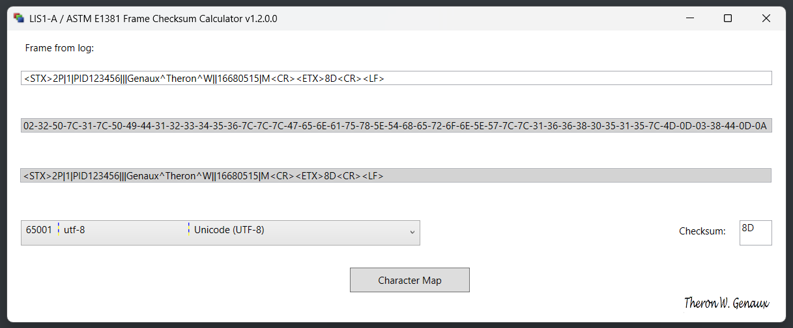

# Calculates and Verifies LIS01 Low-Level Protocol Frame Checksums


 


The LIS1-A / ASTM E1381 Frame Checksum Calculator (LFCC) can be used to calculate or verify the checksum of an LIS01 frame.

The LIS02 specification describes the structure and content of messages sent between an instrument and a Laboratory Information System (LIS). These messages are used to send orders, receive results, and exchange information with each other. They can be exchanged in network shared folders, serial communication, and TCP/IP protocols.

Below is an LIS02 Message containing four records: Header (H), Patient (P), Order (O), and End of Message (L).

```
H|\^&|||Mini LIS||||||||LIS2-A|20210309142633<CR>
P|1|PID123456||NID123456|Brown^Bobby^B|White|196501020304|M<CR>
O|1|SID305||ABO|N|20210309142633|||||N||||CENTBLOOD<CR>
L|1|N<CR>
```

LIS01 is a specification for a low-level protocol that enables the exchange of LIS02 messages via serial communication and TCP/IP. The protocol is implemented to allow bidirectional communication, where each system takes turns sending and receiving messages. LIS02 messages are sent one line (called a record) at a time. The LIS01 protocol is not limited to just LIS02 messages; it can send any text-based message that its protocol can support. For LIS02 content, an LIS01 message is defined as one LIS02 record.

Each LIS02 record is sent in an LIS01 frame that starts with an \<STX> and ends with a \<CR>\<LF> sequence. The message (record) sits between the \<STX> and the \<ETX>. Each frame contains a checksum, which is used to validate that the message has not been corrupted in transit. The checksum lies between the  \<ETX> and \<CR>\<LF> sequence.

```
End Frame         : <STX><LIS02 Record><ETX><Checksum><CR><LF>
Intermediate Frame: <STX><LIS02 Record><ETB><Checksum><CR><LF>
```

## How to use the Frame Checksum Calculator

Consider that you have to investigate an error, and you have a Wireshark trace of the communication between the LIS and an instrument. You extract the TCP Stream with the issue from the trace, and parse the conversation to make it readable. Such an example is shown below. Note that the patient demographics are fictitious, including the name, which was generated by asking the world for popular German names.

**TCP Stream extracted from Wireshark PCAP file**

```
tcp.stream eq 5068
66166 10.9.8.7:65432: <ENQ>
66168  10.88.77.77:12345: <ACK>
66169 10.9.8.7:65432: <STX>1H|\^&|||Mini LIS||||||||LIS2-A|20210309142633<CR><ETX>96<CR><LF>
66170  10.88.77.77:12345: <ACK>
66171 10.9.8.7:65432: <STX>2P|1|PID123456|||Müller^Günther||19650102|M<CR><ETX>54<CR><LF>
66172  10.88.77.77:12345: <NAK>
66173 10.9.8.7:65432: <STX>2P|1|PID123456|||Müller^Günther||19650102|M<CR><ETX>54<CR><LF>
66174  10.88.77.77:12345: <NAK>
66175 10.9.8.7:65432: <STX>2P|1|PID123456|||Müller^Günther||19650102|M<CR><ETX>54<CR><LF>
66176  10.88.77.77:12345: <NAK>
66177 10.9.8.7:65432: <STX>2P|1|PID123456|||Müller^Günther||19650102|M<CR><ETX>54<CR><LF>
66178  10.88.77.77:12345: <NAK>
66179 10.9.8.7:65432: <STX>2P|1|PID123456|||Müller^Günther||19650102|M<CR><ETX>54<CR><LF>
66180  10.88.77.77:12345: <NAK>
66181 10.9.8.7:65432: <STX>2P|1|PID123456|||Müller^Günther||19650102|M<CR><ETX>54<CR><LF>
66182  10.88.77.77:12345: <NAK>
66183  10.88.77.77:12345: <EOT>
```

The \<NAK> in line  66172 indicates a defective frame. If the  Wireshark trace did not capture the local network traffic at the receiver, then the frame error might not be included in the trace.

1. Is the frame complete? It should begin with \<STX> and followed with: a frame number (FN), the LIS2 record (text) ending with a \<CR>, then the frame type \<ETB> or \<ETX>, the checksum ASCII characters C1 and C2, and it should end with a \<CR>\<LF>.
2. Check the frame number located right after the \<STX>. Frame numbers are single digits, incrementing from 0 to 7 and wrapping back to zero. If the previous frame received an \<ACK>, the defective frame should either be zero or the next incremented value.
3. Does the LIS2 record end with a \<CR>? Not all systems require this.
4. Is the frame type correct or missing?
5. Are the checksum characters correct? 
6. Does the frame end with a \<CR>\<LF>?

Surprise, we will focus only on verifying the frame checksum with the LFCC tool. For this inquiry, we have been informed that both sides are configured to use the UTF-8 character encoding.

We can copy the first NAK'd frame and paste it into the LFCC tool, and then select the UTF-8 encoding from the list.

 

Note that the frame checksum from the Wireshark trace is "54" and the LFCC tool calculates it as "5A". The receiver of the frame will recalculate the checksum and verify it against the checksum in the frame; if they don't match, the frame is NAK'd, as is the case here.

We then follow up by asking the FSE to verify that both sides are configured to use the same character encoding, as indicated by the mismatch in checksums. Another possibility is that the checksum was calculated before the frame was converted to UTF-8. 

This example is based on a handful of issues from the field. Most were due to the two sides not being configured to the same character encoding. A couple of errors occurred because the LIS software calculated the checksum before the frame was converted to the target encoding after updating its code to handle multiple character encodings. 

Due to time differences and limited resources, resolving the issue could take several days. Once, I used the LFCC tool to determine the sender's character encoding by noting its location and trying a few commonly used encodings. Many character encodings may result in converting the non-ASCII characters in a record to the same bytes, as many encodings target the same regions, with only slight variations.

If we step through the ISO 8859 encodings, 1-16, we find that the sender may be configured to use ISO 8859 1-4, 13, or 15. Of course, it could be one of the Windows code pages, such as 1252.


## References

- [LIS01A2E](https://clsi.org/standards/products/automation-and-informatics/documents/lis01/), Specification for Low-Level Protocol to Transfer Messages Between Clinical Laboratory Instruments and Computer Systems
- [LIS02A2E](https://clsi.org/standards/products/automation-and-informatics/documents/lis02), Specification for Transferring Information Between Clinical Laboratory Instruments and Information Systems
- Hendrickson Group - [Calculating the checksum of an ASTM document](https://www.hendricksongroup.com/code_003.aspx) 


